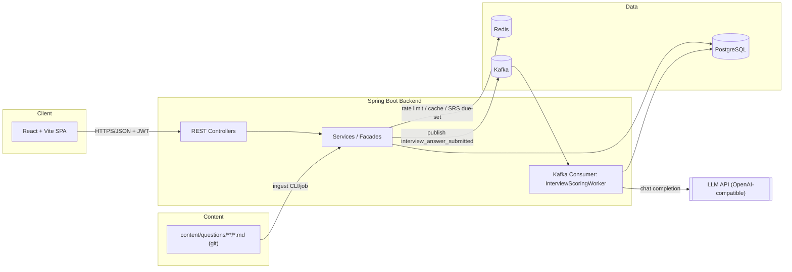
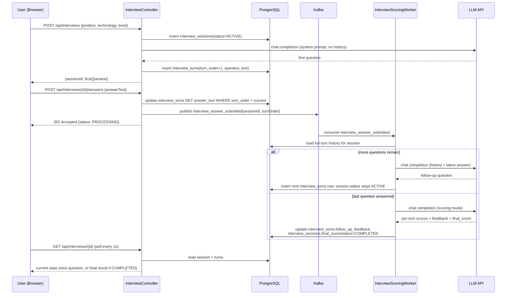
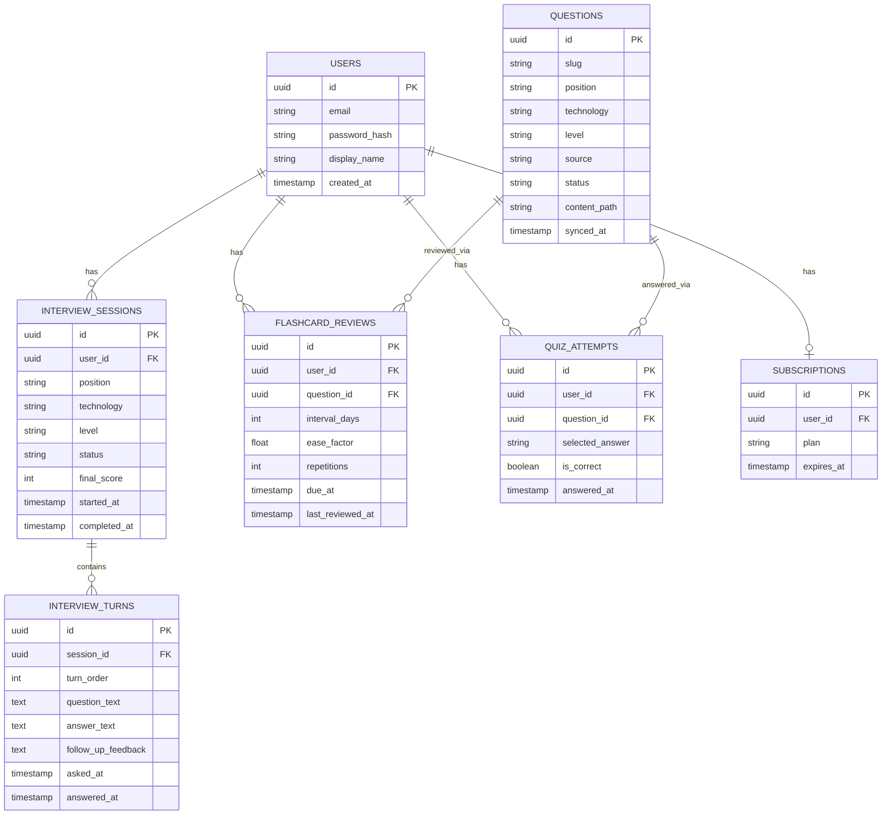
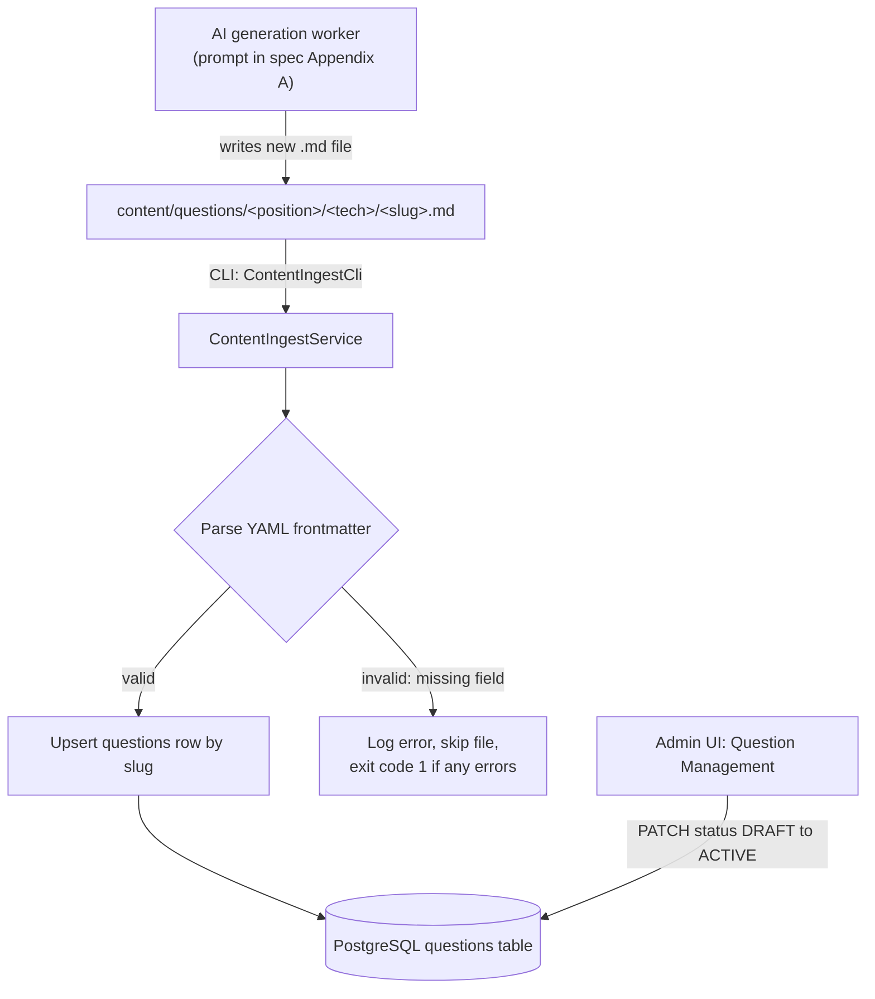

# Interview Arena — Implementation Plan Overview

> This file is an **index + shared architecture reference**, not an executable
> plan itself (no checkboxes here). Each phase file below is its own
> executable plan — follow **superpowers:subagent-driven-development** or
> **superpowers:executing-plans** on each phase file, in order.

**Spec:** `docs/superpowers/specs/2026-08-24-interview-arena-design.md`

## Phase plans (execute in this order)

1. `2026-08-24-interview-arena-01-foundation.md` — monorepo scaffold, infra
   (Postgres/Redis/Kafka via docker-compose), Spring Boot skeleton, JWT auth,
   Flyway baseline schema, React skeleton wired to auth.
   **Run `2026-08-24-interview-arena-01b-ci.md` (GitHub Actions CI) right
   after this plan's Task 1 (repo scaffolding), before Task 2** — this is
   an explicit priority so every commit from Task 2 onward is covered by
   CI from the start, not bolted on later.
2. `2026-08-24-interview-arena-02-question-bank.md` — Markdown content
   pipeline (ingest `.md` → DB index), question browsing API + FE.
3. `2026-08-24-interview-arena-03-flashcard-srs.md` — SM-2 spaced
   repetition, Redis due-cards sorted set, FE flashcard review UI.
4. `2026-08-24-interview-arena-04-quiz.md` — Quiz attempts API + FE.
5. `2026-08-24-interview-arena-05-ai-mock-interview.md` — AI Mock Interview:
   sessions/turns entities, Kafka async scoring pipeline, LLM client, FE
   chat UI. **This is the core differentiator feature.**
6. `2026-08-24-interview-arena-06-progress-subscription.md` — progress
   dashboard, Redis quota rate limiting, subscription/freemium gating.

Dependency notes:
- Phases 2-6 all depend on Phase 1 (auth, DB, infra).
- Phase 3 (flashcard) and Phase 4 (quiz) depend on Phase 2 (`questions`
  table must exist and be populated).
- Phase 5 (AI interview) does **not** depend on Phase 2 — it generates its
  own questions live via LLM — but reuses the `position`/`technology`/
  `level` vocabulary established in Phase 1.
- Phase 6 depends on Phase 5 (quota gating wraps the interview-creation
  endpoint) and Phase 1 (subscriptions belong to a user).

## Repository layout (established in Phase 1, referenced by all phases)

```
interview-arena/
  docker-compose.yml
  backend/
    pom.xml
    src/main/java/com/interviewarena/
      InterviewArenaApplication.java
      config/           (SecurityConfig, KafkaConfig, RedisConfig, WebConfig)
      auth/             (JwtService, JwtAuthFilter, AuthController, AuthService)
      user/             (User entity, UserRepository)
      question/         (Question entity/repo/service/controller, content ingest)
      flashcard/        (FlashcardReview entity/repo/service/controller, SM2Calculator)
      quiz/             (QuizAttempt entity/repo/service/controller)
      interview/        (InterviewSession/InterviewTurn entities, service, controller,
                          kafka producer/consumer, LlmClient)
      subscription/     (Subscription entity/repo/service, quota filter)
      common/           (exception handling, ApiResponse envelope)
    src/main/resources/
      application.yml
      db/migration/     (Flyway V1__..., V2__..., ...)
    src/test/java/com/interviewarena/...  (mirrors main package structure)
  web/
    src/
      api/              (fetch client, per-feature api modules)
      auth/             (AuthContext, useAuth)
      pages/            (Login, Register, QuestionBank, Flashcards, Quiz,
                          InterviewSetup, InterviewSession, Progress)
      components/       (shared UI: Button, Card, Layout, MarkdownRenderer)
      types/            (shared TS types mirroring backend DTOs)
    package.json
    vite.config.ts
  content/
    questions/<position>/<technology>/<slug>.md
  docs/
    superpowers/{specs,plans}/
```

## Diagrams

### System architecture



### AI Mock Interview flow (Kafka async)



### Data model (ER diagram)



### Markdown content ingestion pipeline


